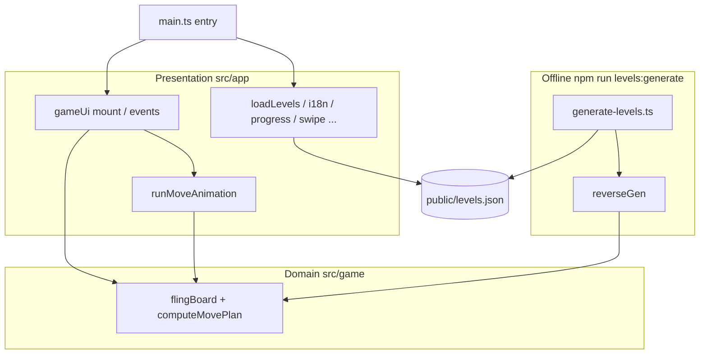

# Fling Web (browser remake)

**Languages:** [简体中文](README.md)

Vite + TypeScript. Board rules match the chained **HOG2** Fling semantics (`src/game/flingBoard.ts`).

## Architecture overview

Dependencies and data flow between the **browser runtime**, **rules kernel**, **level pack**, and **offline generator** (arrows = calls or reads).



- **Runtime**: `GameSession` lives inside `gameUi`; a legal move uses `computeMovePlan` + `runMoveAnimation`, then `move` commits state (see `docs/PROJECT_RULES.md` §4.4).  
- **Offline**: the generator writes `levels.json`; `src/levels/schema.ts` and `levelIndex.ts` define types and the 75-slot index.  
- **Styles**: `src/style.css`, bundled to `dist/assets/*.css` by Vite.

## Usage

### Run locally

1. Install dependencies: `npm install`
2. Dev server: `npm run dev`, then open the URL shown in the terminal (usually `http://localhost:5173`)
3. Production preview: `npm run build`, then `npm run preview`

The game loads the level pack from `public/levels.json` (currently **75 levels**: 15 worlds × 5 stages, matching `TOTAL_LEVEL_SLOTS` in `src/levels/levelIndex.ts`). No extra generation step is required to play.

### Board size

- The offline generator **`scripts/generate-levels.ts`** uses a fixed grid of **7 columns × 8 rows** (`BOARD_W` × `BOARD_H`); every level in `levels.json` has the same `width` / `height`.
- The UI renders that grid; players **cannot** change board dimensions at runtime. If the generator changes in the future, `width` and `height` in each level record remain authoritative.

### Deploying (production)

This is a **static front-end only**—no separate backend. Steps:

1. On your machine or CI, install dependencies and build:
   ```bash
   npm install
   npm run build
   ```
2. Output is in **`dist/`** (`index.html`, `assets/`, and files copied from `public/` such as **`levels.json`**). Upload **everything inside `dist/`** to your static host.
3. Open the site root in a browser (e.g. `https://your-domain/`).

**Smoke-test locally**: after build, run `npm run preview` (default `http://localhost:4173`); use `npm run preview -- --host` for LAN.

**Typical hosts**: any static file host works—Nginx, object storage + CDN, Vercel, Netlify, Cloudflare Pages, GitHub Pages, etc. Upload **`dist` contents** (not the whole repo).

**If the site is not at the domain root** (e.g. `https://user.github.io/repo-name/`), set `base: '/repo-name/'` in `vite.config.ts` and rebuild; otherwise `levels.json` may fail to load. Root or subdomain root usually needs no `base` change.

### Controls

| Action | Description |
|--------|-------------|
| Select | **Tap** a cell with a ball (movement below swipe threshold); tap the same cell or an **empty** cell to clear selection |
| Shoot | **Swipe** on a ball cell (four directions, distance above threshold), or select then press **arrow keys** (↑↓←→) |
| Undo | Undo one step (disabled after win/loss) |
| Restart | Reset the current level |
| Hint | One step from the packaged solution; if you diverged, you must undo or restart |
| Levels | **Previous** / **Next**; **Next** unlocks only after clearing the current level (progress in browser `localStorage`) |

**Pointer / touch (implementation)**: the board uses **Pointer Events** for mouse and touch; on `pointerup`, enough movement shoots, otherwise it counts as selection. `preventDefault()` on `pointerdown` for ball cells, plus `.board .cell { touch-action: none }` in `src/style.css`, reduces scroll gestures turning into `pointercancel` or stale `pointerup` listeners. Each new `pointerdown` clears the previous window listeners; multi-touch uses `pointerId`.

**Accessibility**: the board has `role="grid"`, cells have `role="gridcell"`; only the selected cell is in the Tab order (`tabindex="0"`, others `-1`). The status bar uses `role="status"` on win, `role="alert"` on error (0 balls). Focus ring (dashed, semi-transparent) and selection outline (solid blue) use distinct styles.

**UI language**: use the **EN** / **中文** button at the top-right; preference is saved in `localStorage` (`fling-ui-locale`).

### Move animations (summary)

A legal move plays **Web Animations API** animation first, then updates board state; the board is `aria-busy` during playback.

| Topic | Notes |
|-------|--------|
| Precompute | `computeMovePlan` (`src/game/flingBoard.ts`) builds `roll` / `impact` / `flyOff` without mutating the board, consistent with `move()`. |
| Playback | `src/app/runMoveAnimation.ts`: ghost cell (gray tile moves with the ball); **while rolling**, layered ball (`ball-surface` rotates, `ball-gloss` keeps highlight). Ghost background colors are read from CSS custom properties `--cell-ball-bg` / `--cell-empty-bg` to stay in sync with static cells. |
| Rest state | After roll or parked striker, inner DOM swaps to **`.ball-plush`** (`swapToPlush`) to match static cells and avoid color mismatch. |
| Easing | Roll: `ease-out`; fly-off: `ease-out`; opacity fades in the last part of fly-off. |
| Reduced motion | If the user's system has `prefers-reduced-motion` enabled, CSS disables transitions/animations and JS skips WAAPI playback — moves take effect instantly. |
| Style | `src/style.css`: glow via `box-shadow` + `--glow` to avoid `filter: blur` flicker. |

### Board coordinates

- **Columns**: left to right `A`, `B`…`Z`, then `AA`, `AB`… (Excel-style)
- **Rows**: top to bottom `1`, `2`, `3`…
- A cell is **column letter + row number**, e.g. top-left **A1** (labels on the board when applicable)

### Deep link

Query `?level=0` (first slot) through `?level=74` (last of 75 slots). If locked, the app jumps to an allowed level.

### Regenerate levels (optional)

After changing generator logic or seeds: `npm run levels:generate` overwrites `public/levels.json`. Optional env vars `LEVELGEN_MAX_WORLD`, `LEVELGEN_SEED` (see `docs/CONTEXT_HANDOFF.md`). Then run `npm run levels:validate`.

## Scripts

| Command | Description |
|---------|-------------|
| `npm run dev` | Local development |
| `npm run build` | Production build |
| `npm run test` | Unit tests (Vitest) |
| `npm run coverage` | Tests + coverage (thresholds in `vite.config.ts`) |
| `npm run levels:generate` | Generate `public/levels.json` |
| `npm run levels:validate` | Validate level pack |
| `npm run test:e2e` | Playwright E2E (needs `dist/` or run `npm run build` first) |
| `npm run test:e2e:install` | Install Chromium (once before E2E) |
| `npm run verify:e2e` | `build` + E2E |
| `npm run verify` | test + coverage + build + `levels:validate` |
| `npm run verify:all` | `verify` then E2E |

First-time E2E: `npm run test:e2e:install` or `npx playwright install chromium`.

## Documentation

**Level count, 7×8 board, and related numbers are defined in `docs/LEVEL_SPEC.md` and `docs/PROJECT_RULES.md` §3** (aligned with `src/levels/levelIndex.ts` and the generator).

- **`docs/CONTEXT_HANDOFF.md`** — handoff notes (rules, generation, pitfalls, commands)  
- **`docs/PROJECT_RULES.md`** — project rules (gameplay, levels, engineering; source of truth across sessions)  
- **`docs/LEVEL_GENERATION.md`** — offline level generation (algorithm, pipeline, commands; why forward DFS vs reverse)  
- `docs/LEVEL_SPEC.md` — level JSON, 75-level topology, board size  
- `docs/IMPLEMENTATION_PLAN.md` — phased plan and tests  
- `docs/TEST_TRACEABILITY.md` — requirements ↔ tests  

## Layout

- `src/game/` — rule core (including `computeMovePlan` for animation)  
- `src/app/` — UI and session (`runMoveAnimation.ts`, `i18n.ts`, …)  
- `src/levels/` — level index and JSON types  
- `scripts/` — offline generators, etc.  
- `public/levels.json` — runtime level pack (generated)  

## License

This project is licensed under the **MIT License** — see the [`LICENSE`](LICENSE) file in the repository root.
